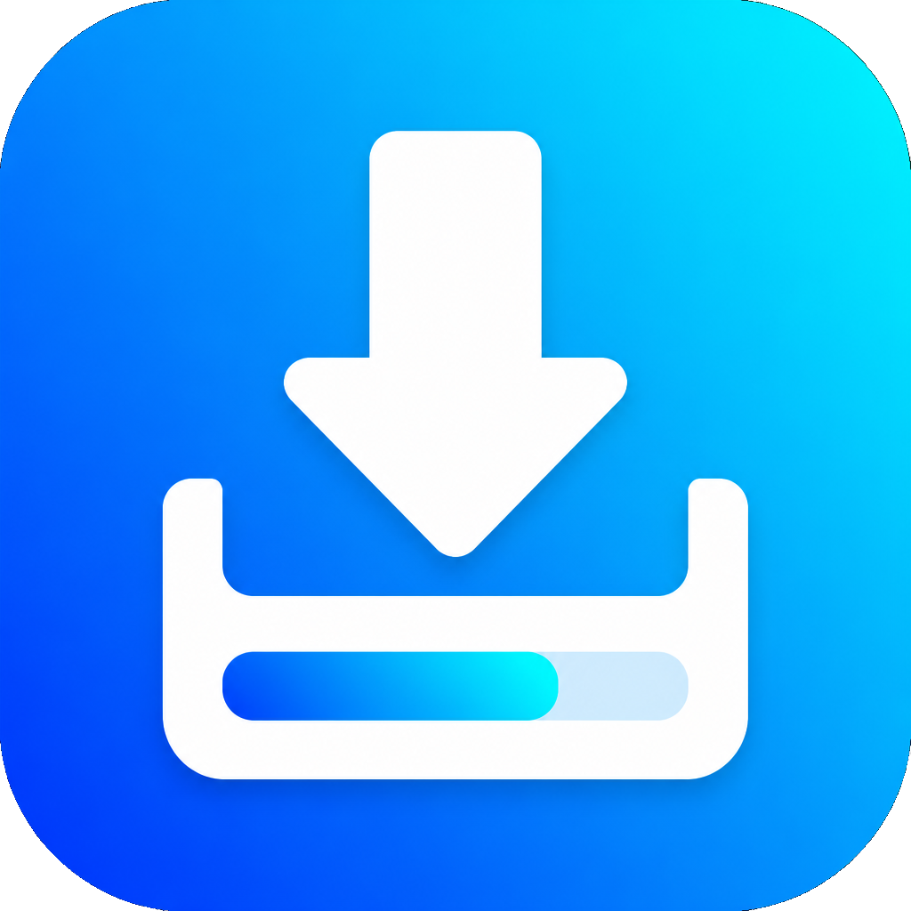
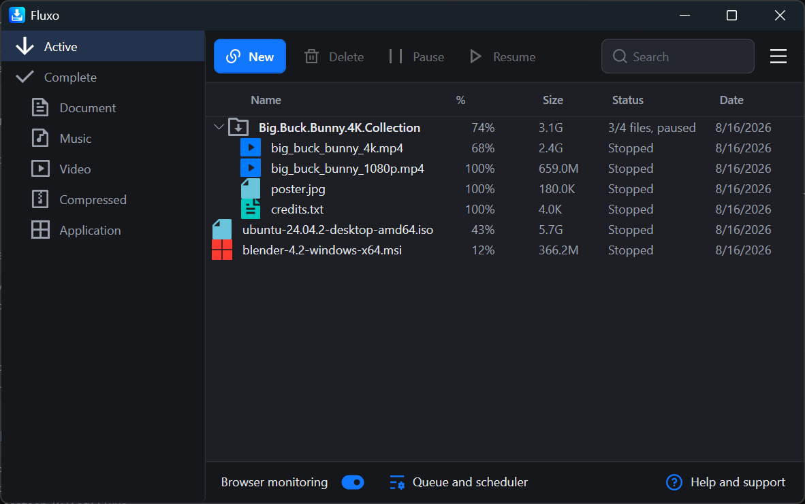
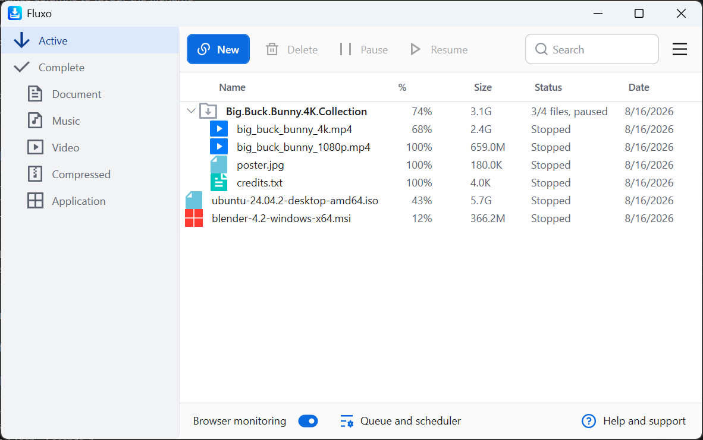
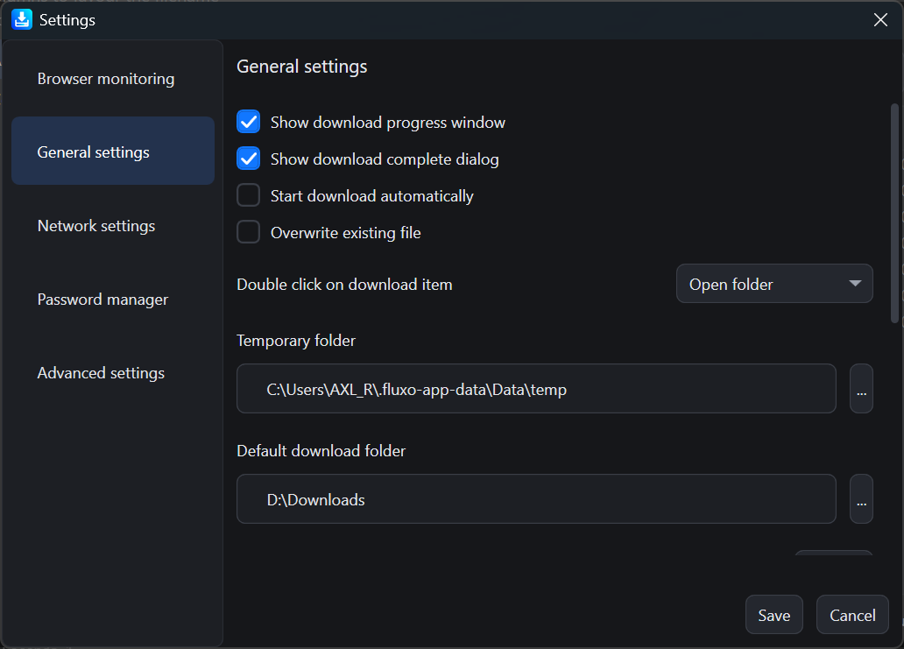

<p id="downloads" align="center">
	
	<h1 align="center">Fluxo</h1>
</p>

> **Fluxo** is a fork of [Xtreme Download Manager (XDM)](https://github.com/subhra74/xdm) by subhra74, renamed and maintained independently. All credit for the original design and engine goes to the upstream XDM project.

Fluxo is a download accelerator and video downloader. It splits downloads into parallel
segments to increase speed, saves video from streaming sites, resumes broken downloads,
and can queue and schedule transfers.

It runs on **Windows** (WPF) and **Linux** (GTK).

## Screenshots

The interface was rebuilt for Fluxo: a shared design language across both platforms,
a light theme that is a real theme rather than a fallback, and torrents shown as one
expandable row.



A torrent downloads as a single entry — expand it to see the individual files, with the
parent summarising total size, combined progress and how many files are done.

| Light theme | Settings |
| --- | --- |
|  |  |


## Features
- Downloads files in parallel segments, typically several times faster than a plain browser download.
- Saves video from numerous streaming sites.
- **Torrents, magnet links and premium hoster links via [AllDebrid or Real-Debrid](#torrents-via-a-debrid-service).**
- Built in video converter for MP3 and MP4 output.
- Supports `HTTP`, `HTTPS`, `FTP` and the streaming protocols `MPEG-DASH`, `Apple HLS` and `Adobe HDS`.
- Authentication, proxy servers, cookies and redirection, including NTLM and Kerberos.
- Clipboard monitoring, antivirus checking, scheduler, and system shutdown on completion.
- Resumes downloads broken by connection loss, power failure or an expired session.
- Browser integration for Chrome, Edge, Brave, Opera, Vivaldi, Firefox and other Chromium
  and Firefox based browsers — see [Browser integration](#browser-integration).

## Torrents via a debrid service

Fluxo does not embed a BitTorrent client. Instead it hands torrents to a debrid service —
a paid service that downloads the torrent on its own infrastructure and exposes the result
over HTTPS. Fluxo then downloads those links normally, so torrent files get the same
segmented speed, resume and queueing as any other download — and your machine never joins
the swarm.

Four services are supported, and an active subscription to one of them is required.

**Setup** — paste your credentials into **Settings → Premium hosters**:

| Service | Credentials | Torrents |
| --- | --- | --- |
| [AllDebrid](https://alldebrid.com) | API key from [alldebrid.com/apikeys](https://alldebrid.com/apikeys/) | Yes |
| [Real-Debrid](https://real-debrid.com) | API token from [real-debrid.com/apitoken](https://real-debrid.com/apitoken) | Yes |
| [Premiumize](https://www.premiumize.me) | API key from [premiumize.me/account](https://www.premiumize.me/account) | Yes |
| [premium.to](https://premium.to) | User ID and API key, both from the site's Account page | No — hoster links only |

Filling in one is enough. With more than one, the **Order to try services in** list on the
same page decides: the first service that has credentials is the one used, and **Move up** /
**Move down** reorder it.

premium.to unlocks hoster links but has no torrent support in its API, so torrents skip
past it to the next service in your order that can take one. Ranking it first therefore
costs nothing. Note that its downloads carry your credentials in the URL — that is how its
API works, and the URL is stored with the download.

Premiumize resolves magnets and hoster links in a single request. A `.torrent` file takes
a slower path, since its API accepts uploads only on the endpoint that fetches into your
Premiumize cloud storage: Fluxo uploads it, waits for the transfer, then reads the links
back out of the resulting folder. The transfer is left in your account afterwards, because
deleting it would invalidate the links being downloaded.

**Use** — toolbar **New → Add torrent / magnet**, then supply any of:

| Input | What happens |
| --- | --- |
| Magnet link | Submitted to the service, which fetches the torrent |
| `.torrent` file | Uploaded to the service (use **Browse…**) |
| Premium hoster link | Unlocked directly, no torrent involved |

For a torrent, Fluxo waits while the service caches it, then queues **every** file at once —
there is no file picker to work through. The files are saved into a folder mirroring the
torrent's own layout, so nested folders come out the same shape they went in.

In the download list the torrent appears as a single row that expands to show its files,
summarising total size, combined progress and how many files are done. Pausing, resuming
or deleting that row applies to the whole torrent. Only one "download complete" notice is
shown, once the last file lands.

**Add torrent / magnet** is disabled until an API key is set, since without one there is
nothing Fluxo can do with a torrent.

## Browser integration

The extensions are **not published to any store**, so they have to be loaded manually.
Full instructions, for both Chromium browsers and Firefox, are in
[docs/browser-extensions.md](docs/browser-extensions.md).

Both extensions are Manifest V3. The extension talks to the running app over
`127.0.0.1:8597`, so Fluxo must be running for it to connect.

## Building from source

Fluxo targets **.NET 10** — install the [.NET 10 SDK](https://dotnet.microsoft.com/download/dotnet/10.0).

```
cd app/Fluxo
dotnet build Fluxo.sln
```

Or open `app/Fluxo/Fluxo.sln` in Visual Studio.

| Project | Target | Platform |
| --- | --- | --- |
| `Fluxo.Wpf.UI` | `net10.0-windows` | Windows |
| `Fluxo.Gtk.UI` | `net10.0` | Linux |

Run the tests with:

```
dotnet test app/Fluxo/Fluxo.Tests/Fluxo.Tests.csproj
```

### Packaging

- **Windows installer** — see [app/Fluxo/Fluxo.Win.Installer/ReadMe.txt](app/Fluxo/Fluxo.Win.Installer/ReadMe.txt).
  Needs WiX v5; produces a self-contained MSI, so users need no .NET runtime installed.
- **Linux packages** — `make-deb-pkg`, `make-rpm-pkg` and `make-arch-pkg` in
  `app/Fluxo/Fluxo.Linux.Installer/`.

## Licence

GPL, see [LICENSE](LICENSE).


